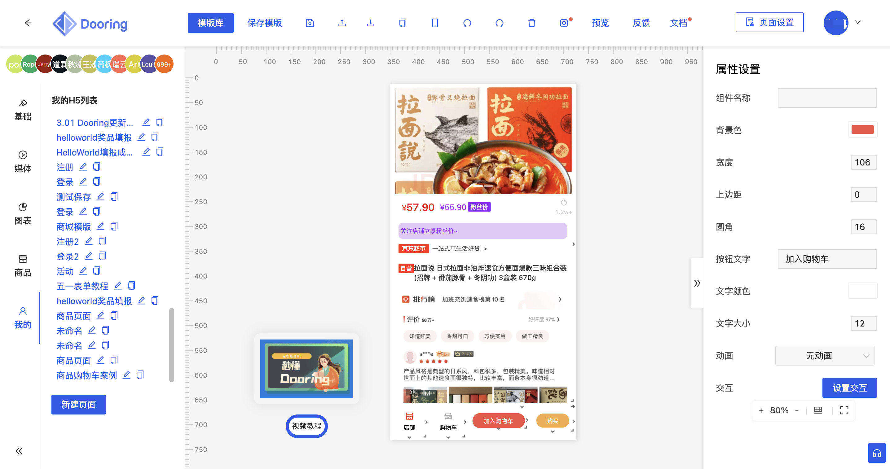

### Hi there 👋

I am Xu xiaoxi, currently focusing on front-end engineering and visualization research. The recently developed projects include:

- [H5-Dooring | 让H5制作像搭积木一样简单](https://github.com/MrXujiang/h5-Dooring)
- [V6.Dooring | 数据可视化大屏搭建引擎](http://v6.dooring.cn/beta)
- [simpleCMS | 强大的支持多皮肤的开源CMS博客系统](https://github.com/MrXujiang/simpleCMS)
- [frontend-developer-roadmap | 大前端用不加班必备宝典](https://github.com/MrXujiang/frontend-developer-roadmap)

### Skill description

`Javascript`, `React`, `Vue`, `NodeJS`.
